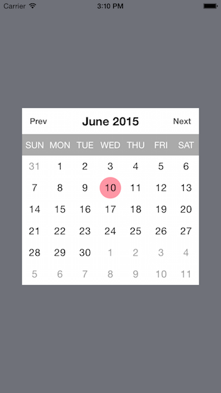

# iOS calendar component writtern in swift
Usage
========
1. Drag the `CalendarKit` folder into your project directory.
2. You can add the calendar to a placeholder view, so create an outlet for it.
<pre lang="Swift">
@IBOutlet var placeholderView: UIView!
</pre>
3. Your `viewDidLoad` method in the `Viewcontroller` should look like
<pre lang="Swift">
override func viewDidLoad() {
        super.viewDidLoad()
        
        // todays date.
        let date = NSDate()
        
        // create an instance of calendar view with 
        // base date (Calendar shows 12 months range from current base date)
        // selected date (marked dated in the calendar)
        let calendarView = CalendarView.instance(date, selectedDate: date)
        calendarView.delegate = self
        calendarView.setTranslatesAutoresizingMaskIntoConstraints(false)
        placeholderView.addSubview(calendarView)
        
        // Constraints for calendar view - Fill the parent view.
        placeholderView.addConstraints(NSLayoutConstraint.constraintsWithVisualFormat("H:|[calendarView]|", options: NSLayoutFormatOptions(0), metrics: nil, views: ["calendarView": calendarView]))
        placeholderView.addConstraints(NSLayoutConstraint.constraintsWithVisualFormat("V:|[calendarView]|", options: NSLayoutFormatOptions(0), metrics: nil, views: ["calendarView": calendarView]))
    }
</pre>
4. Implement the delegate method
<pre lang="Swift">
func didSelectDate(date: NSDate) {
        println("\(date.year)-\(date.month)-\(date.day)")
    }
</pre>
Make sure your `Viewcontroller` class conforms to `CalendarViewDelegate` protocol.

Licence
========
MIT

Screenshot
========

